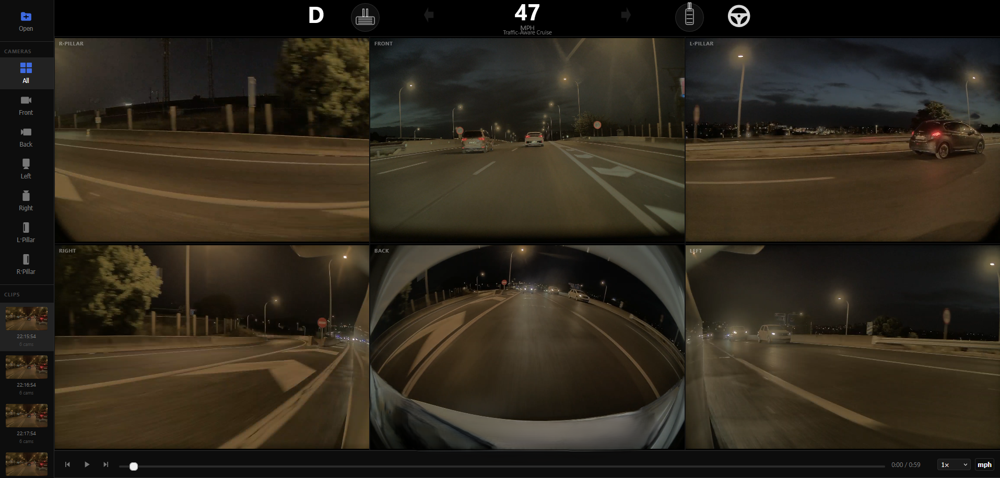

# Tesla Dashcam Viewer

A fully static web app for browsing and reviewing Tesla Sentry Mode and Dashcam recordings. Drag a folder of MP4 clips onto the page and get instant multi-camera playback with a live telemetry HUD — no upload, no account, no install.



---

## Features

- **Multi-camera playback** — front, back, left/right repeaters, and pillar cameras in a synchronized quad grid
- **Live telemetry HUD** — speed, gear, brake/accelerator pedal pressure, steering angle, blinkers, and autopilot state
- **Smooth hardware-accelerated video** — native `<video>` elements with canvas overlay; no WebCodecs dependency
- **SEI metadata parsing** — protobuf telemetry extracted in a Web Worker off the main thread
- **Camera focus mode** — click any camera to expand it full-width; click All to return to quad view
- **Clip navigation** — sidebar list with timestamps and camera count; prev/next buttons and keyboard arrows
- **Scrubber with live preview** — drag to seek; frames update immediately without blocking playback
- **Speed unit toggle** — switch between mph and km/h
- **Playback speed control** — 0.25×, 0.5×, 1×, 2×
- **Event metadata** — shows city, trigger reason, and timestamp from `event.json` when present

---

## Quick Start

### Option A — Use it online (nothing to install)

Open **<https://trax69.github.io/tesla-dashcam-viewer>** and drag your dashcam folder onto the page.

Everything runs inside your browser — your videos are read locally and **never uploaded anywhere**.

### Option B — Just open the file (works offline)

Download or clone the repo and **double-click `index.html`**. No server, no install.

Browsers block Web Workers on `file://`, so telemetry is parsed on the main thread instead — everything still works, loading a clip may just feel slightly less smooth.

### Option C — Local server (best for development)

```bash
git clone https://github.com/trax69/tesla-dashcam-viewer.git
cd tesla-dashcam-viewer
npx serve
```

Then open the printed URL (e.g. `http://localhost:3000`). The **Live Server** extension for VS Code works just as well. Served over HTTP, SEI parsing runs in a Web Worker off the main thread.

## Requirements

- A modern browser: Chrome 90+, Edge 90+, or Firefox 90+
- That's it — no build step, no runtime dependencies

---

## Keyboard Shortcuts

| Key | Action |
|-----|--------|
| `Space` | Play / Pause |
| `←` | Seek back 10 seconds |
| `→` | Seek forward 10 seconds |
| `↑` | Previous clip |
| `↓` | Next clip |

---

## Supported Cameras

| Name | Description |
|------|-------------|
| `front` | Forward-facing main camera |
| `back` | Rear camera |
| `left_repeater` | Left side repeater |
| `right_repeater` | Right side repeater |
| `left_pillar` | Left B-pillar (Model X/S) |
| `right_pillar` | Right B-pillar (Model X/S) |

Not all cameras are present in every clip — the grid adapts automatically.

---

## HUD Telemetry Fields

| Field | Source | Notes |
|-------|--------|-------|
| Speed | `vehicle_speed_mps` | Converted to mph or km/h |
| Gear | `gear_state` | P / D / R / N |
| Brake | `brake_applied` | Boolean — full red fill when pressed |
| Accelerator | `accelerator_pedal_position` | 0–100 % — bubble fills proportionally |
| Steering | `steering_wheel_angle` | Degrees — wheel icon rotates |
| Blinkers | `blinker_on_left/right` | Animated green arrows |
| Autopilot | `autopilot_state` | Self Driving / Autosteer / Traffic-Aware Cruise |

---

## Tesla File Format

Tesla saves dashcam footage in folders named `YYYY-MM-DD_HH-MM-SS/`. Each folder contains:

```
2024-08-05_23-21-49/
  2024-08-05_23-21-49-front.mp4
  2024-08-05_23-21-49-back.mp4
  2024-08-05_23-21-49-left_repeater.mp4
  2024-08-05_23-21-49-right_repeater.mp4
  event.json          ← trigger reason, city, timestamp
  thumb.png           ← thumbnail shown in the sidebar
```

Drag the parent folder (containing multiple event folders) to load all clips at once, or drag a single event folder.

---

## Architecture

```
index.html             — app shell, layout, controls
css/                   — dark UI theme, split by area (tokens, sidebar, video, controls…)
src/
  app.js               — main controller: boot, file parsing, clip loading, UI wiring
  parser.js            — filename → clip-group parsing
  constants.js         — shared constants
  state.js             — shared app state
  proto.js             — inlined SEI protobuf schema (mirror of vendor/dashcam.proto)
  sei-parser.js        — SEI frame extraction, shared by worker & main-thread fallback
  player.js            — Player + CameraTrack: video elements, rAF draw loop, drift correction
  hud.js               — TeslaHUD: canvas 2D telemetry overlay
  worker-sei.js        — Web Worker: SEI NAL unit extraction + protobuf decode
  ui/                  — DOM helpers: clip list, camera grid, loading overlay, event info
assets/
  wheel.svg            — steering wheel icon source
  screenshot.png       — README screenshot
vendor/
  protobuf.min.js      — protobufjs (browser build)
  dashcam-mp4.js       — MP4 demuxer + SEI parser
  dashcam.proto        — protobuf schema for Tesla SEI metadata
```

**Data flow:**
1. User drops a folder → `src/app.js` parses filenames into clip groups
2. Per clip: `src/player.js` creates a `<video>` element per camera and a Web Worker
3. Worker reads the MP4 binary, extracts SEI NAL units, decodes protobuf → returns per-frame metadata (on `file://`, where workers are blocked, the same parser runs on the main thread)
4. rAF loop (30 fps) draws each `<video>` frame to its `<canvas>`, then calls `src/hud.js` with the current SEI

---

## Deploying Your Own Copy (GitHub Pages)

The repo is ready for GitHub Pages out of the box (`index.html` at the root, `.nojekyll` included):

1. Push the repository to GitHub
2. **Settings → Pages → Build and deployment** → Source: *Deploy from a branch* → Branch: `main`, folder `/ (root)`
3. Your viewer is live at `https://<your-username>.github.io/tesla-dashcam-viewer`

---

## Credits

The MP4 demuxer, SEI NAL unit parser, and protobuf schema used to extract telemetry from Tesla dashcam videos are taken directly from the official **[teslamotors/dashcam](https://github.com/teslamotors/dashcam)** repository:

| File | Source |
|------|--------|
| `vendor/dashcam-mp4.js` | `dashcam-mp4.js` — MP4 parser + SEI extractor |
| `vendor/dashcam.proto` | `dashcam.proto` — protobuf schema for SEI metadata |

SEI metadata is embedded in MP4 files by Tesla firmware 2025.44.25+ on HW3+ hardware.

---

## License

MIT — see [LICENSE](LICENSE).
